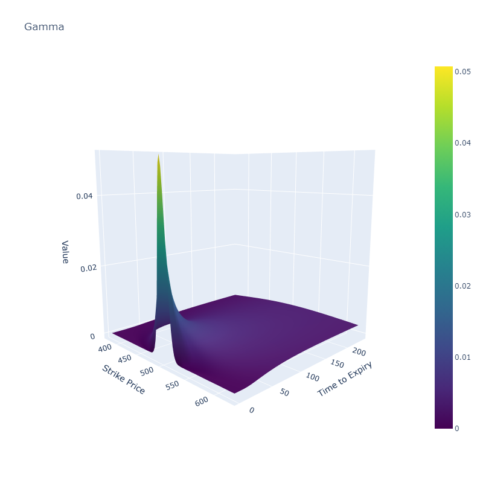
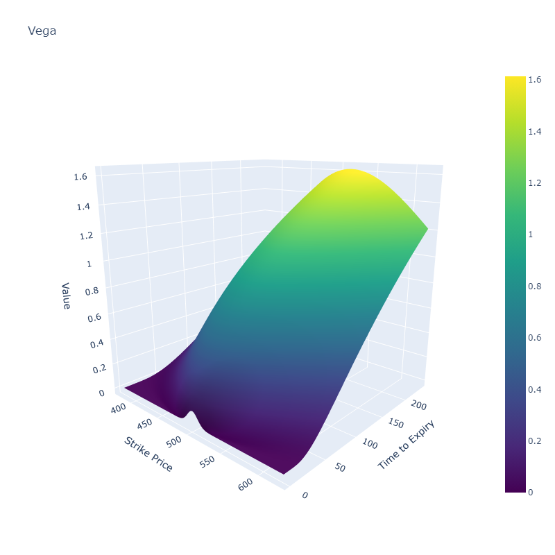
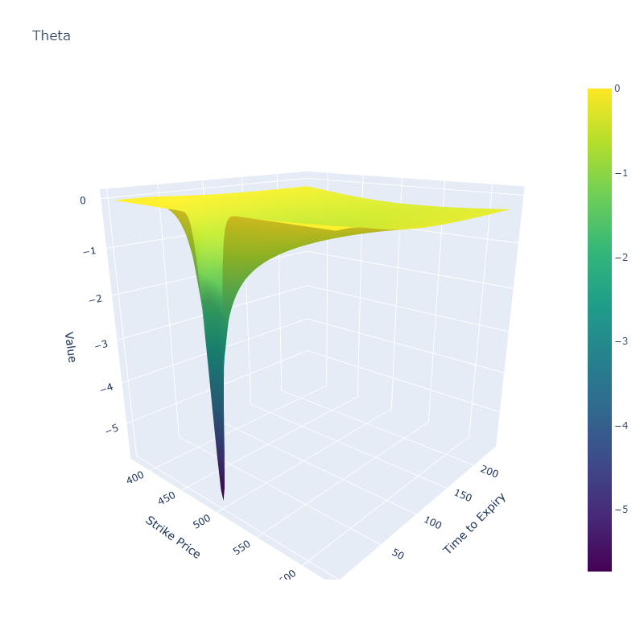

# Options-Calculator

### Notebook with functions to calculate and visualise European option prices and greeks using black-scholes.

Also includes methods to obtain the implied volality of the options given their current price.

ToDo:
- Pull real option price data and :
  - Compare BS prices to current market for options
  - Plot the volatility "smile" for given option expiry, across its strike prices

Here is a link to the interactive plot:
[link](./option.html)

and the plot:



Visualisations made by interating over grid of strike prices and time to expiries, to show how the greeks Gamma,Vega and Theta vary over this space.

